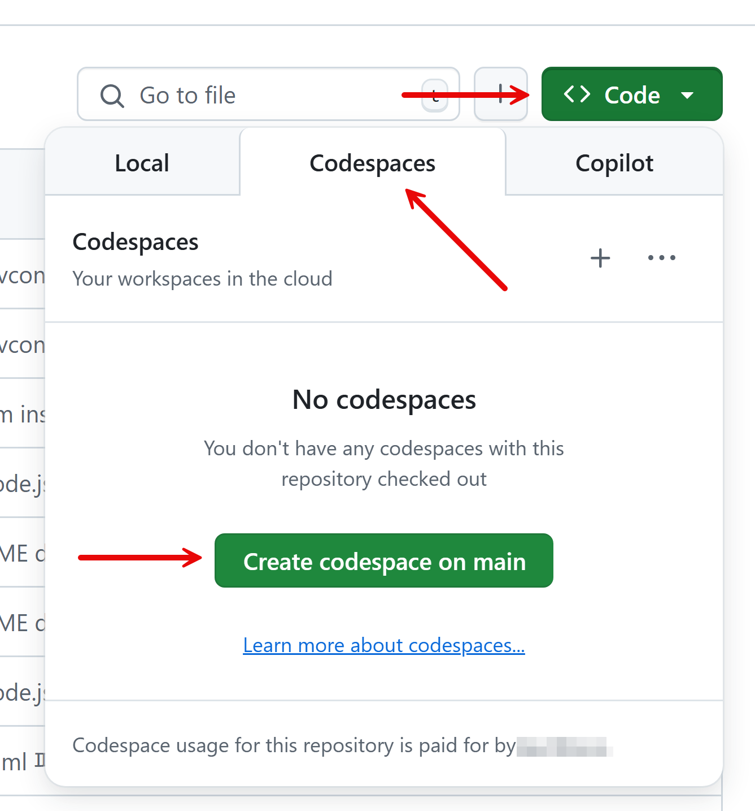

# 00: 개발 환경 설정

이 단계에서는 워크샵 진행을 위해 필요한 개발 환경을 설정합니다.

## 사전 준비사항

[README](../README.md) 문서를 참조하여 개발 환경을 준비합니다.

## 순서

- [GitHub Codespaces로 시작하기](#github-codespaces로-시작하기)
- [Visual Studio Code로 시작하기](#visual-studio-code로-시작하기)
  - [PowerShell 설치 확인 👉 Windows 사용자용](#powershell-설치-확인--windows-사용자용)
  - [git CLI 설치 확인](#git-cli-설치-확인)
  - [GitHub CLI 설치 확인](#github-cli-설치-확인)
  - [Docker Desktop 설치 확인](#docker-desktop-설치-확인)
  - [Visual Studio Code 설치 확인](#visual-studio-code-설치-확인)
  - [Visual Studio Code 시작](#visual-studio-code-시작)

## GitHub Codespaces로 시작하기

1. 아래 이미지를 따라 차례로 `[<> Code]` 👉 `[Codespaces]` 👉 `[Create codespace on main]`를 클릭해서 GitHub Codespaces 인스턴스를 생성합니다. 네트워크 사정에 따라 대략 5분-10분 정도 걸립니다.

   

1. 터미널에서 아래 명령어를 실행하여 개발에 필요한 언어와 프레임워크 등이 올바르게 설치되었는지 확인합니다.

    ```bash
    # Python 버전 확인
    python --version
    ```

    ```bash
    # Node.js 버전 확인
    node --version
    npm --version
    yarn --version
    ```

    ```bash
    # JDK 버전 확인
    java --version
    ```

    ```bash
    # .NET SDK 버전 확인
    dotnet --list-sdks
    ```

1. 아래 명령어를 실행시켜 현재 리포지토리의 클론 상태를 확인합니다.

    ```bash
    git remote -v
    ```

   아래와 같은 결과가 보여야 합니다.

    ```bash
    origin  https://github.com/devrel-kr/github-copilot-bootcamp-2025.git (fetch)
    origin  https://github.com/devrel-kr/github-copilot-bootcamp-2025.git (push)
    ```

   만약 위와 같은 결과가 보이지 않는다면 GitHub Codespaces 인스턴스를 삭제하고 다시 생성해야 합니다.

**👇👇👇 아래 내용부터는 로컬 PC에 VS Code를 설치하고 워크샵을 진행할 때 필요한 내용입니다. GitHub Codespaces 인스턴스를 사용한다면 이 문서의 마지막으로 건너뛰어도 좋습니다. 👇👇👇**

## Visual Studio Code로 시작하기

### PowerShell 설치 확인 👉 Windows 사용자용

1. 터미널에서 아래 명령어를 실행시켜 현재 PowerShell을 설치했는지 확인합니다.

    ```bash
    # Bash/Zsh
    which pwsh
    ```

    ```bash
    # PowerShell
    Get-Command pwsh
    ```

   `pwsh`을 실행시킬 수 있는 경로가 보이지 않는다면 설치하지 않은 것입니다. 만약 설치하지 않았다면 [PowerShell 설치 페이지](https://learn.microsoft.com/powershell/scripting/install/installing-powershell)에서 최신 버전을 다운로드 받아 설치합니다.

1. 터미널에서 아래 명령어를 실행시켜 현재 설치한 PowerShell 버전을 확인합니다.

    ```bash
    pwsh --version
    ```

   `7.5.0` 이상의 버전이 있어야 합니다. 만약 이보다 버전이 낮다면 [PowerShell 설치 페이지](https://learn.microsoft.com/powershell/scripting/install/installing-powershell)에서 최신 버전을 다운로드 받아 설치합니다.

### git CLI 설치 확인

1. 터미널에서 아래 명령어를 실행시켜 현재 git CLI를 설치했는지 확인합니다.

    ```bash
    # Bash/Zsh
    which git
    ```

    ```bash
    # PowerShell
    Get-Command git
    ```

   `git`을 실행시킬 수 있는 경로가 보이지 않는다면 설치하지 않은 것입니다. 만약 설치하지 않았다면 [git CLI 설치 페이지](https://git-scm.com/downloads)에서 최신 버전을 다운로드 받아 설치합니다.

1. 터미널에서 아래 명령어를 실행시켜 현재 설치한 git CLI 버전을 확인합니다.

    ```bash
    git --version
    ```

   `2.39.0` 이상의 버전이 있어야 합니다. 만약 이보다 버전이 낮다면 [git CLI 설치 페이지](https://git-scm.com/downloads)에서 최신 버전을 다운로드 받아 설치합니다.

### GitHub CLI 설치 확인

1. 터미널에서 아래 명령어를 실행시켜 현재 GitHub CLI를 설치했는지 확인합니다.

    ```bash
    # Bash/Zsh
    which gh
    ```

    ```bash
    # PowerShell
    Get-Command gh
    ```

   `gh`을 실행시킬 수 있는 경로가 보이지 않는다면 설치하지 않은 것입니다. 만약 설치하지 않았다면 [GitHub CLI 설치 페이지](https://cli.github.com/)에서 최신 버전을 다운로드 받아 설치합니다.

1. 터미널에서 아래 명령어를 실행시켜 현재 설치한 GitHub CLI 버전을 확인합니다.

    ```bash
    gh --version
    ```

   `2.65.0` 이상의 버전이 있어야 합니다. 만약 이보다 버전이 낮다면 [GitHub CLI 설치 페이지](https://cli.github.com/)에서 최신 버전을 다운로드 받아 설치합니다.

1. GitHub에 로그인 했는지 확인합니다.

    ```bash
    gh auth status
    ```

   만약 로그인하지 않았다고 나온다면, `gh auth login` 명령어를 통해 로그인합니다.

### Docker Desktop 설치 확인

1. 터미널에서 아래 명령어를 실행시켜 현재 Docker Desktop을 설치했는지 확인합니다.

    ```bash
    # Bash/Zsh
    which docker
    ```

    ```bash
    # PowerShell
    Get-Command docker
    ```

   `docker`을 실행시킬 수 있는 경로가 보이지 않는다면 설치하지 않은 것입니다. 만약 설치하지 않았다면 [Docker Desktop 설치 페이지](https://docs.docker.com/get-started/introduction/get-docker-desktop/)에서 최신 버전을 다운로드 받아 설치합니다.

1. 터미널에서 아래 명령어를 실행시켜 현재 설치한 Docker Desktop 버전을 확인합니다.

    ```bash
    docker --version
    ```

   `28.0.4` 이상의 버전이 있어야 합니다. 만약 이보다 버전이 낮다면 [Docker Desktop 설치 페이지](https://docs.docker.com/get-started/introduction/get-docker-desktop/)에서 최신 버전을 다운로드 받아 설치합니다.

### Visual Studio Code 설치 확인

1. 터미널에서 아래 명령어를 실행시켜 현재 Visual Studio Code를 설치했는지 확인합니다.

    ```bash
    # Bash/Zsh
    which code
    ```

    ```bash
    # PowerShell
    Get-Command code
    ```

   `code`을 실행시킬 수 있는 경로가 보이지 않는다면 설치하지 않은 것입니다. 만약 설치하지 않았다면 [Visual Studio Code 설치 페이지](https://code.visualstudio.com/)에서 최신 버전을 다운로드 받아 설치합니다.

1. 터미널에서 아래 명령어를 실행시켜 현재 설치한 Visual Studio Code 버전을 확인합니다.

    ```bash
    code --version
    ```

   `1.99.0` 이상의 버전이 있어야 합니다. 만약 이보다 버전이 낮다면 [Visual Studio Code 설치 페이지](https://code.visualstudio.com/)에서 최신 버전을 다운로드 받아 설치합니다.

   > 만약 터미널에서 `code` 명령어를 실행시킬 수 없다면, [이 문서](https://code.visualstudio.com/docs/setup/mac#_launching-from-the-command-line)를 참고하여 설정합니다.

### Visual Studio Code 시작

1. 작업할 디렉토리로 이동합니다.
1. 터미널에서 아래 명령어를 실행시켜 이 리포지토리를 자신의 GitHub 계정으로 포크한 후 자신의 컴퓨터로 클론합니다.

    ```bash
    gh repo fork devrel-kr/github-copilot-bootcamp-2025 --clone
    ```

1. 터미널에서 아래 명령어를 실행시켜 클론한 디렉토리로 이동합니다.

    ```bash
    cd github-copilot-bootcamp-2025
    ```

1. 터미널에서 아래 명령어를 실행시켜 Visual Studio Code를 실행시힙니다.

    ```bash
    code .
    ```

1. Visual Studio Code에서 터미널을 열고 아래 명령어를 실행시켜 현재 리포지토리의 클론 상태를 확인합니다.

    ```bash
    git remote -v
    ```

   이 명령어를 실행하면 아래와 같은 결과가 나와야 합니다. 만약 `origin`에 `devrel-kr`이 보이면 자신의 리포지토리에서 다시 클론해야 합니다.

    ```bash
    origin  https://github.com/<자신의 GitHub ID>/github-copilot-bootcamp-2025.git (fetch)
    origin  https://github.com/<자신의 GitHub ID>/github-copilot-bootcamp-2025.git (push)
    upstream        https://github.com/devrel-kr/github-copilot-bootcamp-2025.git (fetch)
    upstream        https://github.com/devrel-kr/github-copilot-bootcamp-2025.git (push)
    ```

1. 아래 명령어를 실행시켜 [GitHub Copilot 익스텐션](https://marketplace.visualstudio.com/items?itemName=GitHub.copilot)과 [GitHub Copilot Chat 익스텐션](https://marketplace.visualstudio.com/items?itemName=GitHub.copilot-chat)을 설치했는지 확인합니다.

    ```bash
    # Bash/Zsh
    code --list-extensions | grep github.copilot
    ```

    ```powershell
    # PowerShell
    code --list-extensions | Select-String "github.copilot"
    ```

   만약 아무 메시지도 보이지 않는다면, 아직 설치하지 않은 것입니다. 아래 명령어를 실행시켜 GitHub Copilot 익스텐션을 설치합니다.

    ```bash
    code --install-extension "github.copilot" --force && code --install-extension "github.copilot-chat" --force
    ```

---

축하합니다! **개발 환경 설정** 실습이 끝났습니다. 이제 [STEP 01: Python 앱 개발](./01-python.md) 단계로 넘어가세요.
