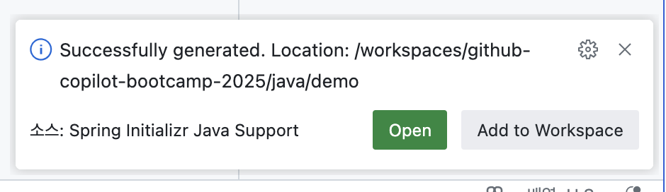
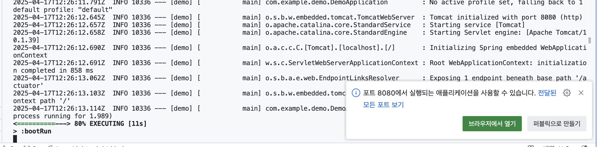

# 03: Java 앱 개발

## 시나리오

Contoso 아웃도어 컴파니의 마케팅 팀에서는 제품 홍보를 위한 마이크로 소셜 미디어 웹사이트를 빠르게 론칭하고 싶어 합니다.

Python 개발자가 백엔드 API를 개발하고 있었습니다만, 개인적인 사정으로 인해 회사를 그만두게 되었습니다! 개발팀의 Java 개발자인 당신은 이 Python 백엔드 API를 Java 기반의 Spring Boot 앱으로 마이그레이션을 해야 합니다.

## 사전 준비사항

[README](../README.md) 문서를 참조하여 개발 환경을 준비합니다.

## 순서

- [개발 과정 프롬프트](#개발-과정-프롬프트)
  - [프론트엔드 앱 및 백엔드 앱 확인](#프론트엔드-앱-및-백엔드-앱-확인)
    - [프론트엔드 앱 및 백엔드 앱 실행 확인](#프론트엔드-앱-및-백엔드-앱-실행-확인)
    - [REST API 확인](#rest-api-확인)
    - [Python 앱 로직 확인](#python-앱-로직-확인)
  - [Spring Boot 앱으로 마이그레이션](#spring-boot-앱으로-마이그레이션)
    - [Spring Boot 프로젝트 생성](#spring-boot-프로젝트-생성)
    - [빌드 및 앱 구동](#빌드-및-앱-구동)
    - [REST API 추가 및 확인](#rest-api-추가-및-확인)
    - [Python에 작성된 REST API 추가](#python에-작성된-rest-api-추가)
    - [Database URL 변경](#database-url-변경)
  - [백엔드 앱 전환 및 확인](#백엔드-앱-전환-및-확인)
    - [확인](#확인)

## 개발 과정 프롬프트

Python 앱으로부터 Spring Boot 앱으로의 전체적인 마이그레이션 과정은 다음과 같습니다.

* [프론트엔드 앱 및 백엔드 앱 확인](#프론트엔드-앱-및-백엔드-앱-확인)
* [Spring Boot 앱으로 마이그레이션](#spring-boot-앱으로-마이그레이션)
* [백엔드 앱 전환 및 확인](#백엔드-앱-전환-및-확인)

### 프론트엔드 앱 및 백엔드 앱 확인

#### 프론트엔드 앱 및 백엔드 앱 실행 확인

이전 세션들에서 수행했던 Python 백엔드 앱 및 Node JS 프론트엔드 앱이 실행되어 있어야 합니다. 특히, Python 백엔드 앱을 기준으로 마이그레이션이 이루어지기 때문에 [http://127.0.0.1:8000/docs](http://127.0.0.1:8000/docs)에 접속하여 해당 앱이 구동되어 있는지를 확인합니다.

만일, 앱이 실행되어 있지 않다면, [Python 앱 가이드](../01-python.md)에 따라 앱을 구동해 주시기 바랍니다.

#### REST API 확인

다음 URL을 호출하여 백엔드 앱에서 제공하고 있는 REST API들을 확인해 봅니다. 아래와 같이 12개의 REST API가 있는 것을 확인할 수 있습니다.

```
http://127.0.0.1:8000/docs
```

#### Python 앱 로직 확인

Python 앱에 어떤 기능들이 포함되어 있는지 확인하기 위해 GitHub Copilot에 다음과 같이 질의합니다. 해당 기능을 확인하여 대략의 Python 로직을 이해하고 파일을 생성합니다.

```
이 파일의 소스 내용을 설명해 주고 다이어그램을 생성해줘
```

다음 위치에 다이어그램 파일이 생성된 것을 확인합니다.

```
.../python/diagram.md
```

### Spring Boot 앱으로 마이그레이션

이제 Spring Boot 앱으로 마이그레이션 할 준비가 되었습니다. 이제부터 GitHub Copilot을 이용하여 마이그레이션을 진행하겠습니다. 이후 질의과정은 예시일 뿐이므로, 본인의 상황에 맞게 변경하여 질의하며 마이그레이션을 진행해도 됩니다.

#### Spring Boot 프로젝트 생성

Spring Boot Initializr를 이용하면 Spring Boot 앱을 쉽게 생성할 수 있습니다. Spring Initializr 익스텐션을 사용하여 VS Code에서 초기 프로젝트를 생성해 보도록 합니다. 설정 값은 다음과 같습니다.

* 프로젝트 선택: Create a Gradle Project
* Spring Boot Version: 3.4.4
* Project language: Java
* Group Id: com.example
* Artifact Id: demo
* Package Name: com.example.demo
* Packaging type: Jar
* Java version: 21
* Dependencies:
  * Spring Web
  * Spring Boot Actuator
  * Lombok

초기 Spring Boot 앱 프로젝트가 생성되었으면 우측 하단에의 "Open new project"를 클릭하여 방금 생성한 프로젝트를 오픈합니다.



#### 빌드 및 앱 구동

최초 생성된 앱이 에러가 없는지 빌드 후 앱 구동을 통해 확인해 봅니다.

```
./gradlew clean build bootRun
```

터미널에 다음과 같은 로그가 출력되면 앱이 정상적으로 구동된 것입니다.



#### REST API 추가 및 확인

디펜던시가 에러 없이 잘 추가되었는지 확인하기 위해 RestController를 추가해 봅니다. 기본 호출할 REST API로 /hello 를 생성해 보겠습니다. GitHub Copilot을 Agent 모드로 변경하고, 모델을 "Claude 3.7 Sonnet"으로 변경한 후 다음과 같이 프롬프트를 입력합니다.

```
/hello REST API를 추가해주고, Swagger 설정도 추가해줘
```

다시 한 번 앱을 빌드하고 실행시켜 봅니다.

코드에 오류가 없으면 다음 URL을 이용하여 앱을 호출해 봅니다.

```
http://localhost:8080/hello
```

이번에는 Swagger UI를 접속해 봅니다.

```
http://localhost:8080/swagger-ui.html
```

앱이 정상적으로 호출되었으면 마이그레이션 준비가 완료된 것입니다.

#### Python에 작성된 REST API 추가

Python 앱은 12개의 REST API로 이루어진 백엔드 서비스로 구성되어 있습니다. 이제 좀 전에 생성한 다이어그램 파일을 활용하여 이 REST API를 자바로 변경해 보겠습니다.

GitHub Copilot에 다음과 같이 프롬프트를 입력합니다.

```
이 다이어그램 파일을 참고해서 동일한 API 주소를 갖는 함수들을 현재 프로젝트에 추가해줘.
```

앱을 빌드하고, Swagger UI에 접속해서 12개의 REST API가 추가되었는지를 확인합니다. 만일 빌드 시 에러가 발생하거나, 원하는 API 목록이 출력되지 않는다면 다음 프롬프트를 사용해서 정상적인 결과값이 나올때까지 수정을 반복해서 이슈를 해결합니다.

```
빌드 시 오류가 발생해. 오류를 해결해줘 
```

#### Database URL 변경

이제 기존 Python에서 사용하던 데이타베이스를 참조하도록 환경을 변경해 봅니다. 해당 파일은 다음 위치에 존재합니다.

```
/workspaces/github-copilot-bootcamp-2025/python/sns.db
```

Spring Boot 프로젝트의 다음 파일을 오픈해서 파일 주소를 변경합니다.

* project_root: /workspaces/github-copilot-bootcamp-2025/java/demo
* 파일 명: <project_root>/src/main/resources/application.properties

변경할 내용은 다음과 같습니다.

```
spring.datasource.url=jdbc:sqlite:sns.db
```

> **NOTE**: 만약 Python 앱에서 쓰던 `sns.db`를 그대로 활용하고 싶다면, `python/sns.db` 파일을 `java/demo/sns.db`로 복사합니다.

다시 앱을 빌드해서 데이타베이스가 제대로 참조되었는지 확인합니다.

### 백엔드 앱 전환 및 확인

#### 확인

이제 모든 코드 생성이 완료되었습니다. 마지막으로 Node JS로 작성된 프론트엔드 앱에서 기존 URL과 동일하게 호출할 수 있도록 Spring Boot 앱의 포트를 변경합니다. 

변경 전 [여기](01-python.md#서비스-종료)를 참고하여 Python 앱을 구동 중지합니다. 


포트 변경을 위한 설정을 변경하기 위해 GitHub Copilot에 다음과 같이 프롬프트를 입력합니다.

```
앱 서비스 포트를 8080으로 변경해줘
```

이제 앱을 다시 빌드하고 구동시켜서 다음 URL로 접속이 되는지를 확인합니다.

```
https://localhost:8080/swagger-ui.html
```

앱이 정상적으로 구동되었으면 Node JS 프론트엔드 앱을 호출하여 앱에 이상이 없는지 확인합니다.

```
http://localhost:3000
```

---

축하합니다! **Java 앱 개발** 실습이 끝났습니다. 이제 [STEP 04: .NET 앱 개발](./04-dotnet.md) 단계로 넘어가세요.
